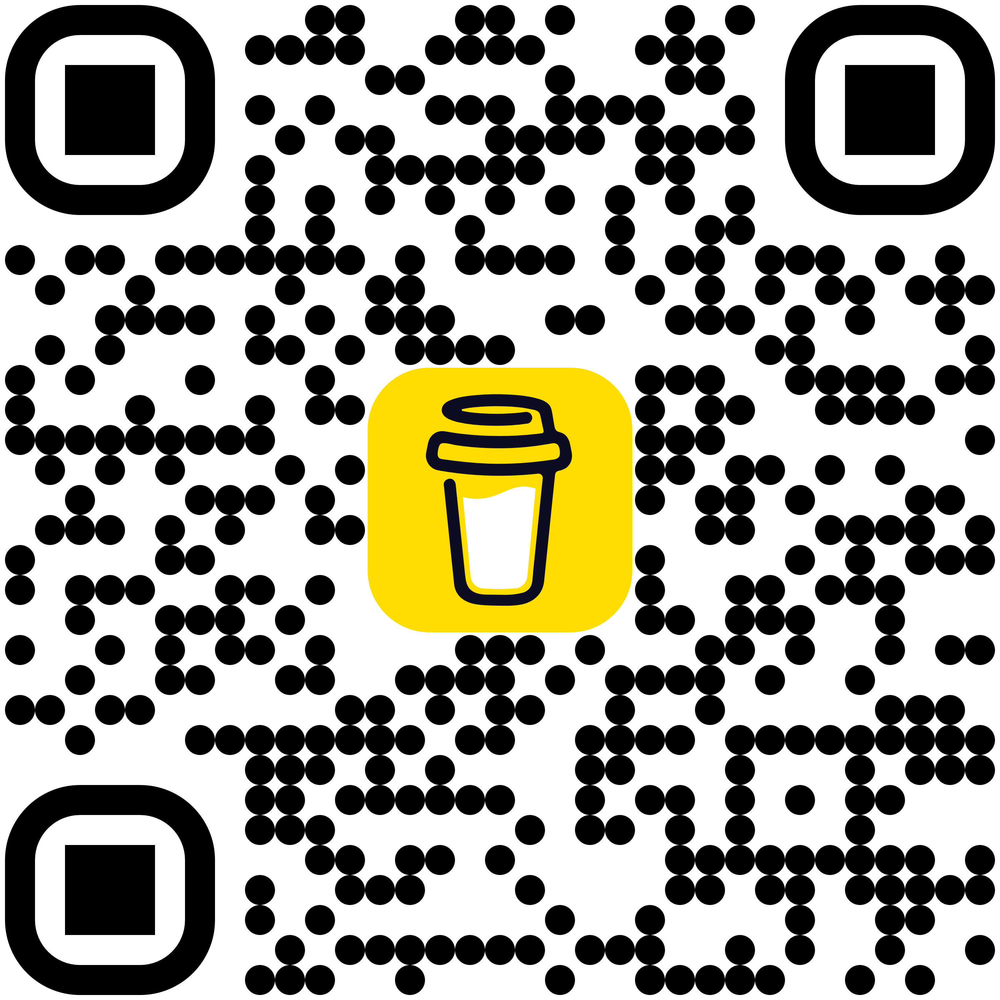

# simple-basic-auth

## Overview


[http.server](https://docs.python.org/ja/3.13/library/http.server.html) 向けの簡素な Basic 認証の機能を提供します。

開発中のソフトウェアに認証機能を追加するために書きました。

> [!NOTE]
> 本ライブラリは、そのまま使うと1ユーザに対する認証しか行えませんので、複数ユーザを対象にするならば追加で工夫が必要になります。

```py
from http.server import BaseHTTPRequestHandler, HTTPServer
from simple_basic_auth import BasicAuth

auth = BasicAuth("anonymous", "password", "SecretZone")

class _Handler (BaseHTTPRequestHandler):
  def do_GET (self):
    if auth.authorize(self):
      self.send_response(200)
      self.send_header("Content-Type", "text/plain; charset=ascii")
      self.end_headers()
      self.wfile.write(b"Authorization was succeed.")
    else:
      auth.send_unauthorized(self)

with HTTPServer(("127.0.0.1", 8080), _Handler) as server:
 try:
   server.serve_forever()
 except KeyboardInterrupt:
   pass
```

## Install

```shell
pip install .
```

### Test

```shell
pip install .[test]
pylint --errors-only src
pytest .
```

### Document

```py
import simple_basic_auth
help(simple_basic_auth)
```

## Donation

<a href="https://buymeacoffee.com/tikubonn" target="_blank"></a>

もし本パッケージがお役立ちになりましたら、少額の寄付で支援することができます。<br>
寄付していただいたお金は書籍の購入費用や日々の支払いに使わせていただきます。
ただし、これは寄付の多寡によって継続的な開発やサポートを保証するものではありません。ご留意ください。

If you found this package useful, you can support it with a small donation.
Donations will be used to cover book purchases and daily expenses.
However, please note that this does not guarantee ongoing development or support based on the amount donated.

## License

© 2026 tikubonn

simple-basic-auth licensed under the [AGPLv3](./LICENSE).
